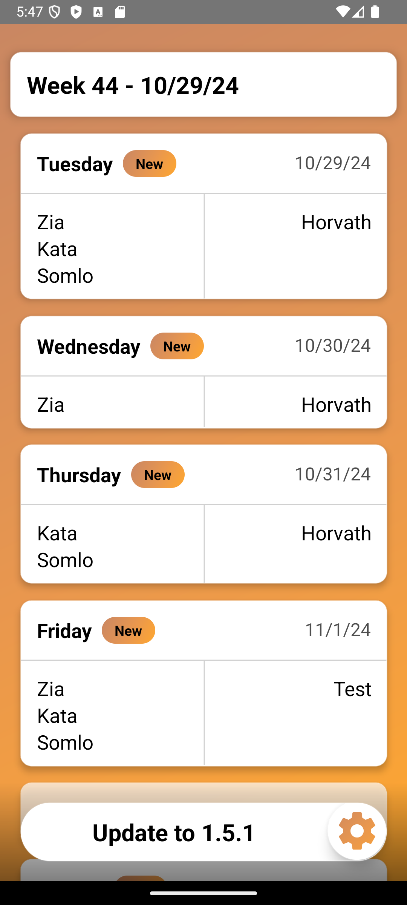
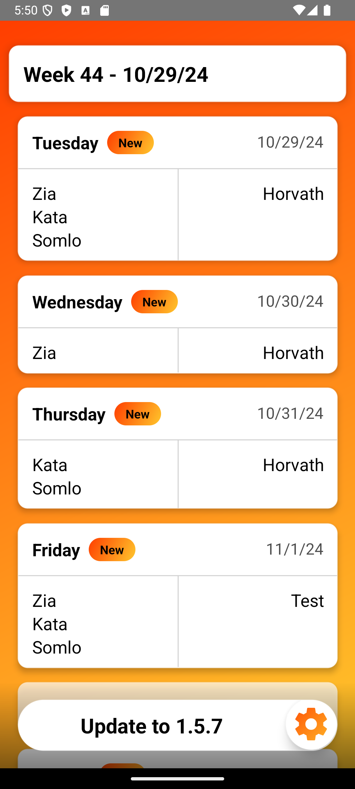
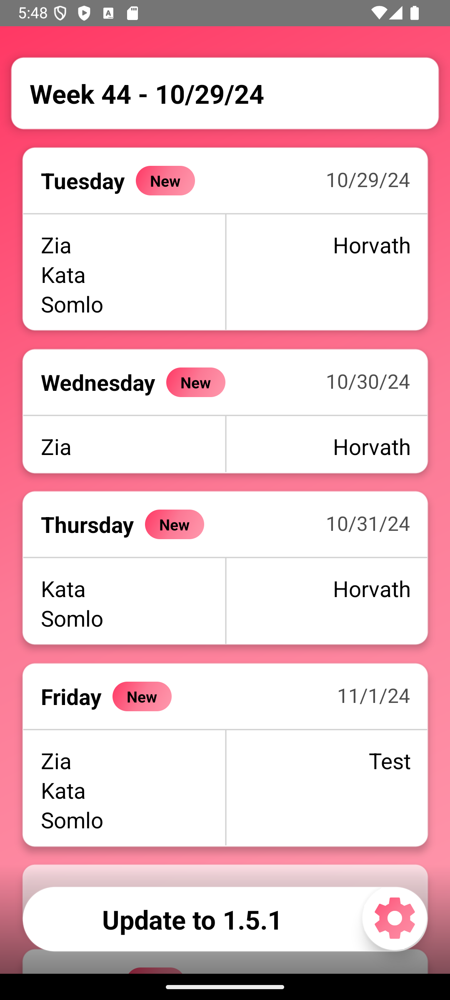
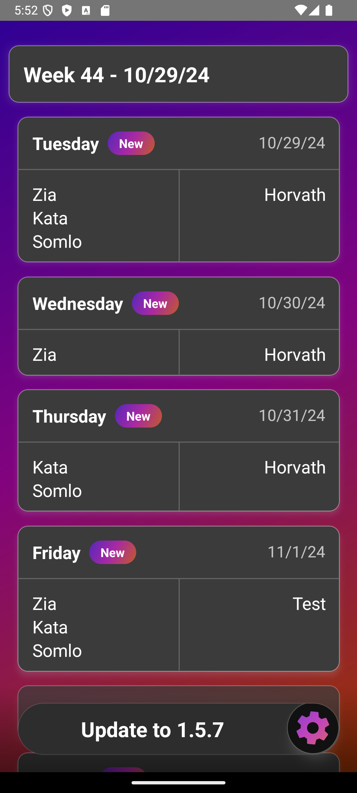
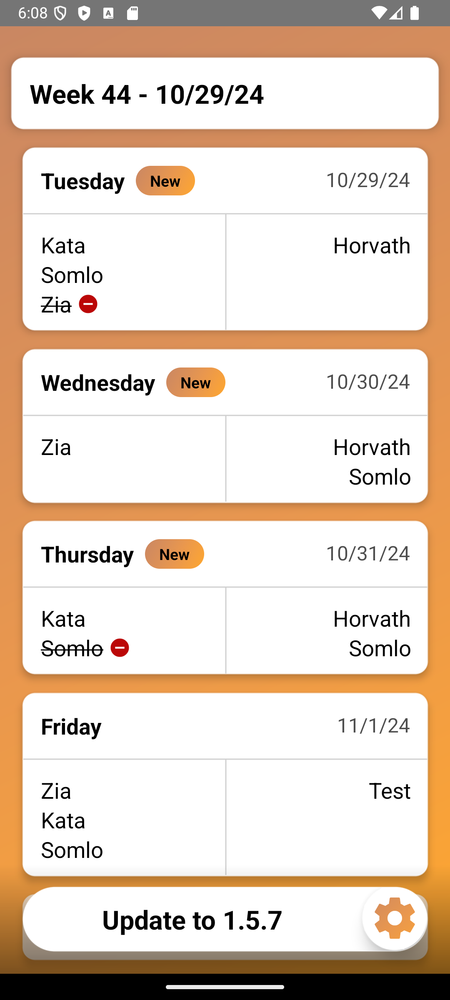
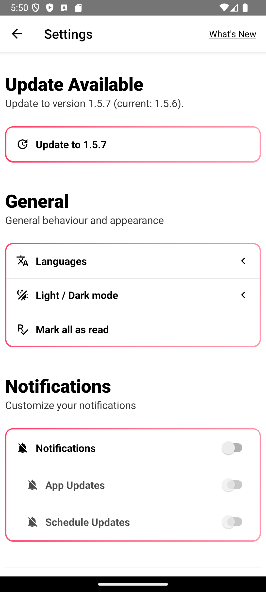
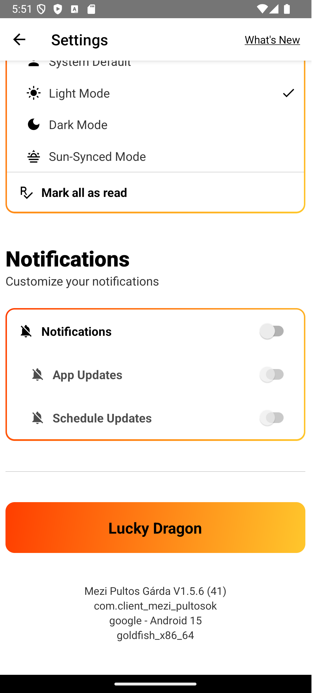
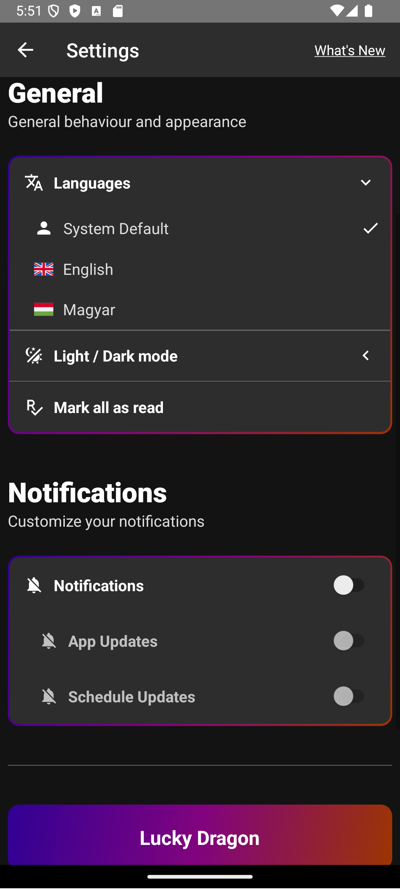

# Mezi Pultos Gárda

## Description
A React Native application that allows users to view the schedules of bartenders (pultosok). 
The app features light/dark modes, sun-synced mode, hungarian and english locales, and push notifications for updates.

Note: This project is **developed only for Android devices**, as I don't have a MacBook to
develop this app on.

## Features

- See the daily working schedule in both places (owned by the same owner)
- Change tracking: See if a schedule was recently added
- Change tracking: See if a person was recently added/removed from an existing daily schedule
- Multiple pre-defined theme colors, each day a theme set is picked randomly
- Notifications upon change in the schedule
- Full CI/CD pipeline for building the application for Android and deploy it to a server (not online anymore)
- Update app from the server

  
  
  
  
  
  
- Dark/Light modes
- Sun-Sync mode: will switch automatically between light and dark modes based on the user's location and the sun position
- Localization (English and Hungarian)






## Installation

Step 1: Clone the repo
```
git clone https://github.com/EnBi81/client_mezi_pultosok.git
```

Step 2: step into the directory
```
cd client_mezi_pultosok
```

Step 3: Install dependencies and run post install script
```
yarn install
yarn run postinstall
```

Step 4: Run the project
```
yarn run android
```

